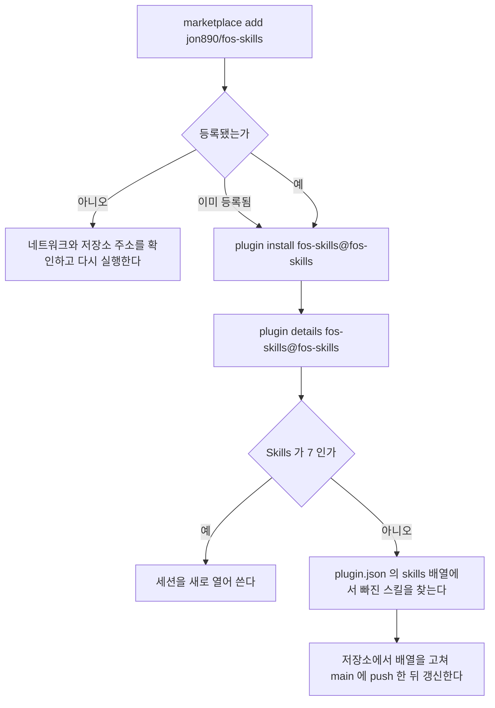
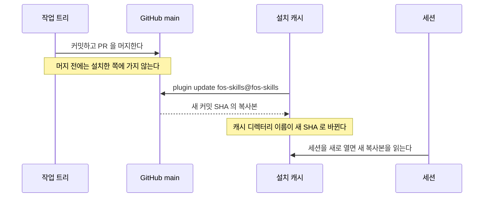
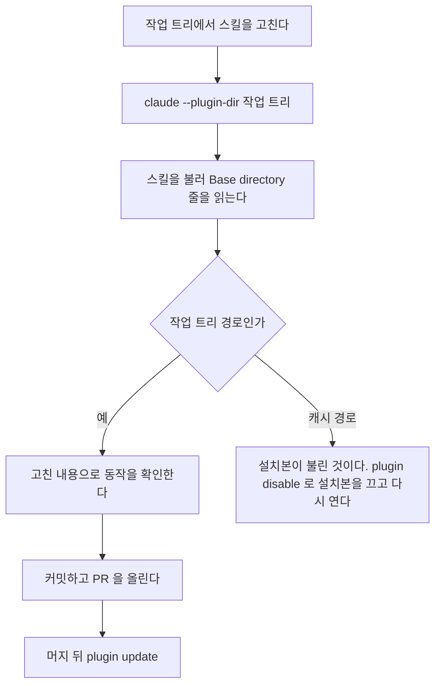
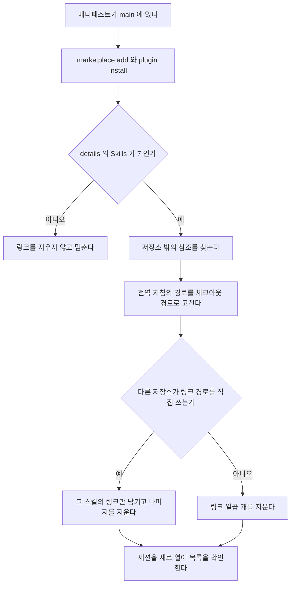

# 흐름

플러그인 `fos-skills` 를 설치하고, 갱신하고, 스킬을 고치는 동안 확인하는 흐름이다.
배치와 경로 참조는 [code-architecture.md](code-architecture.md) 가 소유한다.

## 설치

사람이 터미널에서 시작한다. 이 머신과 사외 머신이 같은 명령을 쓴다.

```bash
claude plugin marketplace add jon890/fos-skills
claude plugin install fos-skills@fos-skills
claude plugin details fos-skills@fos-skills
```



| 상황 | 동작 |
| --- | --- |
| 마켓플레이스가 이미 등록돼 있다 | 등록을 건너뛰고 설치로 간다 |
| 플러그인이 이미 설치돼 있다 | 설치 대신 「갱신」 의 명령을 쓴다 |
| 스킬 수가 일곱보다 적다 | 스킬을 더하고 `skills` 배열을 고치지 않은 것이다. 매니페스트 시험이 같은 것을 저장소에서 잡는다 |

## 갱신

설치한 쪽은 main 의 커밋을 받는다. 버전을 올리는 단계는 없다.

```bash
claude plugin update fos-skills@fos-skills
```



| 상황 | 동작 |
| --- | --- |
| `already at the latest version` 이 나온다 | main 에 새 커밋이 없다. 머지와 push 가 끝났는지 확인한다 |
| 커밋하지 않은 변경이 있다 | 설치본에 가지 않는다. 「고치는 동안의 확인」 으로 본다 |
| 갱신한 뒤에도 옛 내용이 보인다 | 열려 있던 세션은 옛 복사본을 읽는다. 세션을 새로 연다 |

## 고치는 동안의 확인

설치본은 main 에 push 한 뒤에만 바뀐다.
고치는 동안에는 작업 트리를 그 세션에만 직접 로드한다.

```bash
claude --plugin-dir "$(git rev-parse --show-toplevel)"
```



`--plugin-dir` 로 연 세션에서는 작업 트리가 `fos-skills@inline` 으로 로드되고 커밋하지 않은 변경도 읽는다.
설치본 `fos-skills@fos-skills` 도 함께 켜져 있다.
같은 이름의 두 플러그인 가운데 어느 쪽 스킬이 불리는지는 세션을 띄워야 확인되고 격리 환경에서 실측하지 못했다.
그래서 스킬을 부른 뒤 본문 앞의 `Base directory for this skill` 줄로 어느 복사본인지 판정한다.

스크립트만 고쳤으면 세션 없이 작업 트리의 스크립트와 테스트를 직접 실행한다.
`~/.claude/scripts/` 의 훅 링크와 `~/.claude/rules/korean-style.md` 는 체크아웃을 가리키므로, 체크아웃에서 고친 내용은 push 하지 않아도 바로 반영된다.

## 링크 설치에서 옮기기

`~/.claude/skills/<이름>` 링크 일곱 개로 쓰던 머신을 플러그인으로 옮기는 순서다.
매니페스트가 main 에 머지된 뒤에 한 번에 진행한다.



1. 설치하고 `claude plugin details fos-skills@fos-skills` 가 스킬 일곱 개를 보이는지 확인한다. 일곱이 아니면 링크를 지우지 않는다.
2. 저장소 밖에서 링크 경로를 적은 곳을 찾는다.

   ```bash
   grep -rnE '\.claude/skills/(build-with-teams|content-preview|docs-check|harness-cleanup|korean-check|planning|review-fix)' \
     ~/.claude/CLAUDE.md ~/.claude/references ~/.claude/rules
   ```

3. 찾은 경로의 `~/.claude/skills/<스킬>/` 을 `~/personal/fos-skills/<스킬>/` 로 고친다. 캐시 경로는 갱신할 때마다 바뀌므로 적지 않는다.
4. 다른 저장소의 스킬이나 오버레이가 `~/.claude/skills/<스킬>/` 아래 파일을 실행하면 그 스킬의 링크는 그 저장소를 고칠 때까지 남긴다. 설명으로만 적은 경로는 링크를 남길 이유가 아니다.
5. 나머지 링크를 지운다. `~/.claude/scripts/` 와 `~/.claude/rules/` 의 링크는 지우지 않는다. 스킬 링크가 아니라 체크아웃 안의 파일을 가리킨다.
6. 세션을 새로 열어 `fos-skills:` 접두사가 붙은 스킬 일곱 개가 뜨고, 지운 이름이 접두사 없이 뜨지 않는지 확인한다.

| 상황 | 동작 |
| --- | --- |
| 설치한 뒤 링크를 지우기 전 | 같은 스킬이 접두사 있는 것과 없는 것으로 둘씩 뜬다. 1번에서 5번까지를 이어서 진행해 이 기간을 짧게 둔다 |
| 링크를 지우기 전에 열어 둔 세션 | 옛 목록을 그대로 쓴다. 세션을 새로 연다 |
| 링크를 먼저 지우고 설치한다 | 설치가 실패하면 스킬이 하나도 없는 상태가 된다. 그래서 설치를 먼저 한다 |
| 4번 때문에 링크가 하나 남는다 | 그 스킬만 둘로 뜬다. 내용은 체크아웃과 설치본이 같은 저장소에서 온 것이다 |
