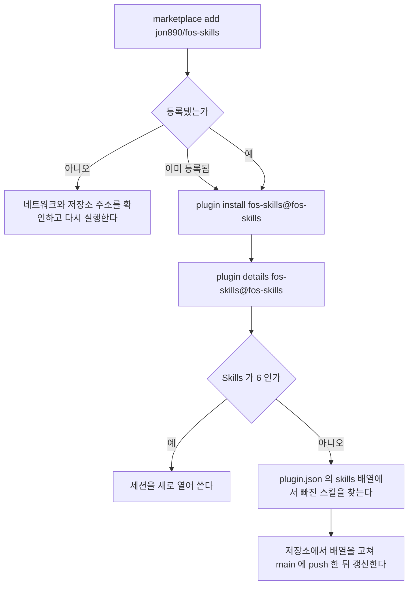
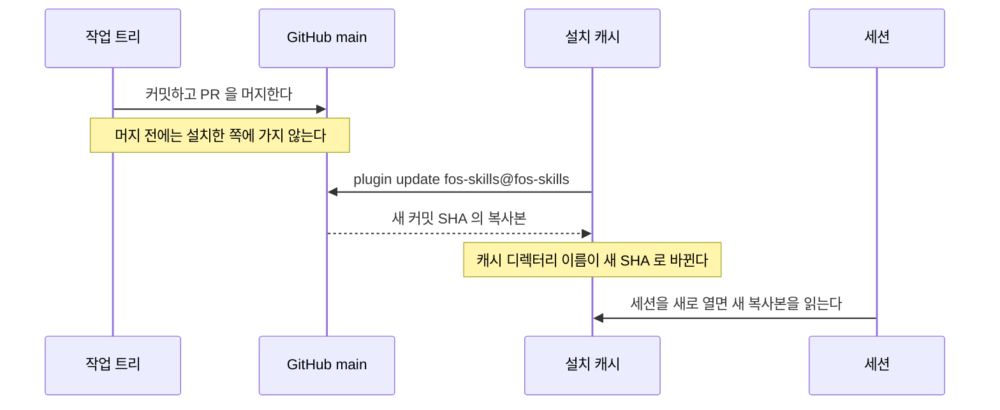
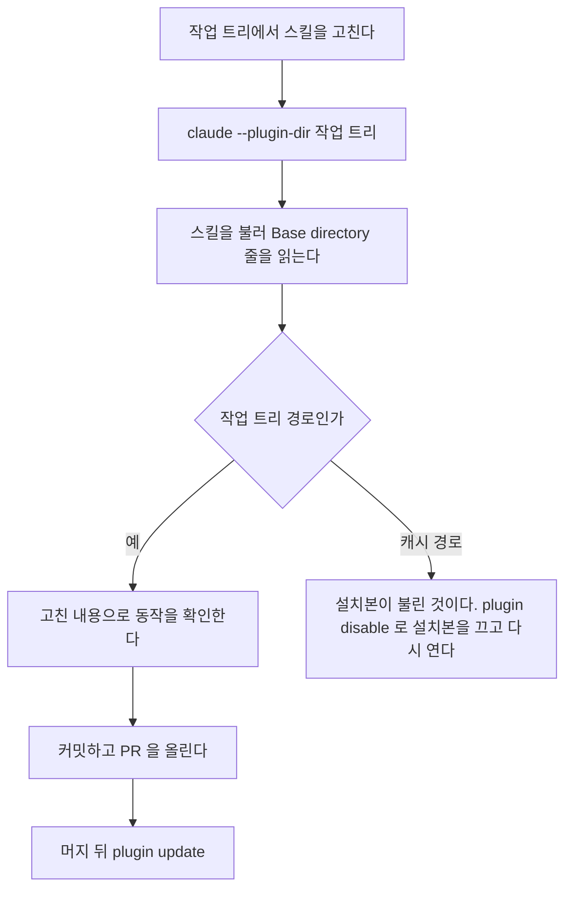
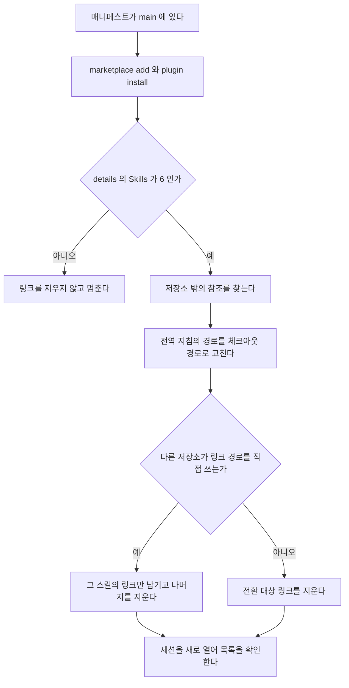
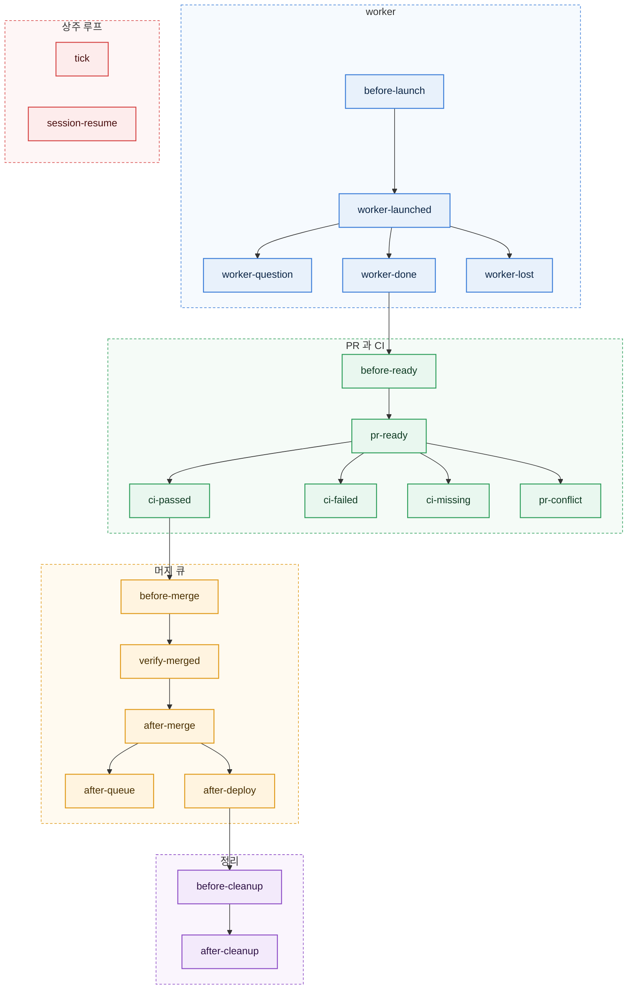

# 흐름

플러그인 `fos-skills` 를 설치하고, 갱신하고, 스킬을 고치는 동안 확인하는 흐름과 orch 의 이벤트 흐름이다.
배치와 경로 참조는 [code-architecture.md](code-architecture.md) 가 소유한다.

## 설치

사람이 터미널에서 시작한다. 이 머신과 사외 머신이 같은 명령을 쓴다.

```bash
claude plugin marketplace add jon890/fos-skills
claude plugin install fos-skills@fos-skills
claude plugin details fos-skills@fos-skills
```

이 설치로 스킬 여섯 개를 받는다.
`content-preview` 와 `korean-check` 의 원본은 여기 있고, 스킬로는 사본을 싣는 팀 저장소의 플러그인으로 받는다.
그 플러그인을 받을 수 없는 환경에서는 두 스킬이 목록에 뜨지 않는다.
파일은 이 플러그인의 설치 캐시에도 남으므로 경로로 직접 읽고 실행할 수 있다.


```mermaid
flowchart TD
    A[marketplace add jon890/fos-skills] --> B{등록됐는가}
    B -- 아니오 --> B1[네트워크와 저장소 주소를 확인하고 다시 실행한다]
    B -- 이미 등록됨 --> C
    B -- 예 --> C[plugin install fos-skills@fos-skills]
    C --> D[plugin details fos-skills@fos-skills]
    D --> E{Skills 가 6 인가}
    E -- 예 --> F[세션을 새로 열어 쓴다]
    E -- 아니오 --> G[plugin.json 의 skills 배열에서 빠진 스킬을 찾는다]
    G --> H[저장소에서 배열을 고쳐 main 에 push 한 뒤 갱신한다]
```

| 상황 | 동작 |
| --- | --- |
| 마켓플레이스가 이미 등록돼 있다 | 등록을 건너뛰고 설치로 간다 |
| 플러그인이 이미 설치돼 있다 | 설치 대신 「갱신」 의 명령을 쓴다 |
| 스킬 수가 여섯과 다르다 | `skills` 배열과 내보내기 전용 원본 목록을 확인한다. 매니페스트 테스트가 미등록 스킬을 저장소에서 잡는다 |

## 갱신

설치한 쪽은 main 의 커밋을 받는다. 버전을 올리는 단계는 없다.

```bash
claude plugin update fos-skills@fos-skills
```


```mermaid
sequenceDiagram
    participant W as 작업 트리
    participant G as GitHub main
    participant C as 설치 캐시
    participant S as 세션
    W->>G: 커밋하고 PR 을 머지한다
    Note over W,G: 머지 전에는 설치한 쪽에 가지 않는다
    C->>G: plugin update fos-skills@fos-skills
    G-->>C: 새 커밋 SHA 의 복사본
    Note over C: 캐시 디렉터리 이름이 새 SHA 로 바뀐다
    S->>C: 세션을 새로 열면 새 복사본을 읽는다
```

| 상황 | 동작 |
| --- | --- |
| `already at the latest version` 이 나온다 | main 에 새 커밋이 없다. 머지와 push 가 끝났는지 확인한다 |
| 커밋하지 않은 변경이 있다 | 설치본에 가지 않는다. 「고치는 동안의 확인」 으로 본다 |
| 갱신한 뒤에도 옛 내용이 보인다 | 열려 있던 세션은 옛 복사본을 읽는다. 세션을 새로 연다 |

## 고치는 동안의 확인

설치본은 main 에 push 한 뒤에만 바뀐다.
고치는 동안에는 작업 트리를 그 세션에만 직접 로드한다.

```bash
claude --plugin-dir "$(git rev-parse --show-toplevel)"
```


```mermaid
flowchart TD
    A[작업 트리에서 스킬을 고친다] --> B[claude --plugin-dir 작업 트리]
    B --> C[스킬을 불러 Base directory 줄을 읽는다]
    C --> D{작업 트리 경로인가}
    D -- 예 --> E[고친 내용으로 동작을 확인한다]
    D -- 캐시 경로 --> F[설치본이 불린 것이다. plugin disable 로 설치본을 끄고 다시 연다]
    E --> G[커밋하고 PR 을 올린다]
    G --> H[머지 뒤 plugin update]
```

`--plugin-dir` 로 연 세션에서는 작업 트리가 `fos-skills@inline` 으로 로드되고 커밋하지 않은 변경도 읽는다.
설치본 `fos-skills@fos-skills` 도 함께 켜져 있다.
같은 이름의 두 플러그인 가운데 어느 쪽 스킬이 불리는지는 세션을 띄워야 확인되고 격리 환경에서 실측하지 못했다.
그래서 스킬을 부른 뒤 본문 앞의 `Base directory for this skill` 줄로 어느 복사본인지 판정한다.

스크립트만 고쳤으면 세션 없이 작업 트리의 스크립트와 테스트를 직접 실행한다.
`~/.claude/scripts/` 의 훅 링크와 `~/.claude/rules/korean-style.md` 는 체크아웃을 가리키므로, 체크아웃에서 고친 내용은 push 하지 않아도 바로 반영된다.

## 링크 설치에서 옮기기

`~/.claude/skills/<이름>` 링크로 쓰던 머신을 플러그인으로 옮기는 순서다.
`content-preview` 와 `korean-check` 는 이 플러그인의 스킬 목록에 없으므로, 팀 저장소의 플러그인으로 받을 수 있는지 별도로 확인한다.
매니페스트가 main 에 머지된 뒤에 한 번에 진행한다.


```mermaid
flowchart TD
    A[매니페스트가 main 에 있다] --> B[marketplace add 와 plugin install]
    B --> C{details 의 Skills 가 6 인가}
    C -- 아니오 --> C1[링크를 지우지 않고 멈춘다]
    C -- 예 --> D[저장소 밖의 참조를 찾는다]
    D --> E[전역 지침의 경로를 체크아웃 경로로 고친다]
    E --> F{다른 저장소가 링크 경로를 직접 쓰는가}
    F -- 예 --> G[그 스킬의 링크만 남기고 나머지를 지운다]
    F -- 아니오 --> H[전환 대상 링크를 지운다]
    G --> I[세션을 새로 열어 목록을 확인한다]
    H --> I
```

1. 설치하고 `claude plugin details fos-skills@fos-skills` 가 스킬 여섯 개를 보이는지 확인한다. 여섯이 아니면 링크를 지우지 않는다.
2. 저장소 밖에서 링크 경로를 적은 곳을 찾는다.

   ```bash
   grep -rnE '\.claude/skills/(build-with-teams|content-preview|docs-check|harness-cleanup|korean-check|planning|pr-review|review-fix)' \
     ~/.claude/CLAUDE.md ~/.claude/references ~/.claude/rules
   ```

3. 찾은 경로의 `~/.claude/skills/<스킬>/` 을 `~/personal/fos-skills/<스킬>/` 로 고친다. 캐시 경로는 갱신할 때마다 바뀌므로 적지 않는다.
4. 다른 저장소의 스킬이나 오버레이가 `~/.claude/skills/<스킬>/` 아래 파일을 실행하면 그 스킬의 링크는 그 저장소를 고칠 때까지 남긴다. 설명으로만 적은 경로는 링크를 남길 이유가 아니다.
5. 나머지 링크를 지운다. `~/.claude/scripts/` 와 `~/.claude/rules/` 의 링크는 지우지 않는다. 스킬 링크가 아니라 체크아웃 안의 파일을 가리킨다.
6. 세션을 새로 열어 `fos-skills:` 접두사가 붙은 스킬 여섯 개가 뜨는지 확인한다. 두 내보내기 전용 스킬은 팀 저장소의 플러그인을 설치했으면 그쪽에만 뜨고, 받을 수 없으면 뜨지 않는다.

| 상황 | 동작 |
| --- | --- |
| 설치한 뒤 링크를 지우기 전 | 같은 스킬이 접두사 있는 것과 없는 것으로 둘씩 뜬다. 1번에서 5번까지를 이어서 진행해 이 기간을 짧게 둔다 |
| 링크를 지우기 전에 열어 둔 세션 | 옛 목록을 그대로 쓴다. 세션을 새로 연다 |
| 링크를 먼저 지우고 설치한다 | 설치가 실패하면 스킬이 하나도 없는 상태가 된다. 그래서 설치를 먼저 한다 |
| 4번 때문에 링크가 하나 남는다 | 그 스킬만 둘로 뜬다. 내용은 체크아웃과 설치본이 같은 저장소에서 온 것이다 |

## orch 이벤트

이 절은 orch 개편 뒤의 흐름이다([ADR-009](adr/009-orch-event-handlers.md)). 구현 PR 이 모두 머지되기 전의 실제 동작은 `orch/SKILL.md` 와 `orch/references/` 가 소유한다.
핸들러의 입력과 종료 코드는 [data-schema.md](data-schema.md) 의 「orch 이벤트 핸들러 입력」, 코어와 핸들러의 경계는 [code-architecture.md](code-architecture.md) 의 「orch 코어와 핸들러」 가 소유한다.

orch 의 공용 코어는 단계마다 이벤트를 낸다. 저장소에 `.orch/hooks/<이벤트>.ts` 가 있으면 그 시점에 실행하고, 없으면 코어 동작만 한다.


```mermaid
%%{init: {"theme":"base","themeVariables":{"fontFamily":"'Noto Sans KR', sans-serif","fontSize":"14px","lineColor":"#7A8594","primaryTextColor":"#1D1F23","edgeLabelBackground":"#FFFFFF","clusterBkg":"#FAFAFA"},"flowchart":{"curve":"basis","nodeSpacing":40,"rankSpacing":60,"padding":14}}}%%
flowchart TD
    subgraph W[worker]
        L[before-launch] --> LA[worker-launched]
        LA --> Q[worker-question]
        LA --> D[worker-done]
        LA --> LO[worker-lost]
    end
    subgraph P[PR 과 CI]
        D --> BR[before-ready] --> R[pr-ready]
        R --> CP[ci-passed]
        R --> CF[ci-failed]
        R --> CM[ci-missing]
        R --> CO[pr-conflict]
    end
    subgraph M[머지 큐]
        CP --> BM[before-merge] --> VM[verify-merged] --> AM[after-merge]
        AM --> AQ[after-queue]
        AM --> AD[after-deploy]
    end
    subgraph C[정리]
        AD --> BC[before-cleanup] --> AC[after-cleanup]
    end
    subgraph T[상주 루프]
        TK[tick]
        SR[session-resume]
    end
    class L,LA,Q,D,LO c1
    class BR,R,CP,CF,CM,CO c2
    class BM,VM,AM,AQ,AD c3
    class BC,AC c4
    class TK,SR c5
    classDef c1 fill:#E8F1FB,stroke:#3B7DD8,stroke-width:1.5px,color:#0B2545
    classDef c2 fill:#E9F7EF,stroke:#2E9E5B,stroke-width:1.5px,color:#0E3B22
    classDef c3 fill:#FFF4E0,stroke:#E09A1A,stroke-width:1.5px,color:#4A3000
    classDef c4 fill:#F3EAFB,stroke:#8E4EC6,stroke-width:1.5px,color:#2E1145
    classDef c5 fill:#FDECEC,stroke:#D64545,stroke-width:1.5px,color:#4A0F0F
    style W fill:#F6FAFE,stroke:#3B7DD8,stroke-dasharray:4 3
    style P fill:#F5FBF7,stroke:#2E9E5B,stroke-dasharray:4 3
    style M fill:#FFFAF0,stroke:#E09A1A,stroke-dasharray:4 3
    style C fill:#FAF5FD,stroke:#8E4EC6,stroke-dasharray:4 3
    style T fill:#FEF6F6,stroke:#D64545,stroke-dasharray:4 3
```

### 이벤트 목록

`거부` 가 예인 이벤트는 핸들러가 다음 동작을 막을 수 있다. 코어 동작과 핸들러의 순서는 거부할 수 있는 이벤트면 핸들러가 먼저, 나머지는 코어 동작 뒤다.

| 이벤트 | 내는 명령 | 시점 | 거부 | 코어 동작 | 핸들러가 맡을 일의 예 |
| --- | --- | --- | --- | --- | --- |
| `before-launch` | `launch-worker` | 워크트리를 만든 뒤, `worker-start` 전 | 예 | 지시서 검사, 허락 줄, deny 규칙 | 저장소의 동시 worker 상한, 준비되지 않은 개발 환경 거부 |
| `worker-launched` | `launch-worker` | `LAUNCHED` 를 낸 뒤 | 아니오 | `LAUNCHED` 줄과 `launch.effective` | 개발 서버 접속 설정을 워크트리에 복사 |
| `worker-question` | `orch-loop`, `watch-questions` | 새 question 이나 escalation 을 처음 알릴 때와 다시 알릴 때 | 아니오 | `QUESTION`, `REMINDER` 줄, 보드 결정 필요 | 메신저 알림 |
| `worker-done` | `wait-important` | `worker_done` 을 받고 완료 근거를 판정한 뒤 | 아니오 | 의심스러운 완료 분리 | 저장소 고유 완료 조건 확인 결과를 출력에 붙인다 |
| `worker-lost` | `wait-important` | 끊긴 dispatch 를 처음 알릴 때 | 아니오 | `WORKER_LOST` 줄과 상태 기록 | runner 호스트 상태 확인 |
| `before-ready` | `ci-ready`, `orch-loop` | draft 를 ready 로 바꾸기 전 | 예 | 겹침과 충돌 보류, ready 슬롯 | 이 저장소에서 CI 를 돌릴 수 없는 시간대 거부 |
| `pr-ready` | `ci-ready`, `orch-loop` | ready 로 바꾼 뒤 | 아니오 | 없음 | 리뷰 요청 |
| `ci-passed` | `orch-loop` | 필수 체크가 모두 통과한 것을 처음 본 때 | 아니오 | 순서 파일에 따라 머지 큐 차례 | 없음 |
| `ci-failed` | `orch-loop` | 필수 체크 하나가 실패한 것을 처음 본 때 | 아니오 | 그 worker 에게 알림 | runner 장애면 다시 실행 |
| `ci-missing` | `orch-loop` | ready 뒤 `pipeline.ci_missing_after_sec` 안에 필수 체크가 나타나지 않을 때 | 아니오 | `CI-MISSING` 줄 | runner 재시작 |
| `pr-conflict` | `notify-conflicts`, `orch-loop` | base 와 충돌하는 내 PR 을 (PR, base SHA) 마다 처음 본 때 | 아니오 | 그 PR 을 만든 worker 에게 base 를 합치라고 보낸다. dispatch 가 끝났으면 남은 터미널에 후속 지시서로 이어 쓴다. 이어 쓰지 못하면 `CONFLICT-ORPHAN` 줄. 새 worker 는 띄우지 않는다 | 없음 |
| `before-merge` | `merge_queue` | PR 마다 머지 직전, HEAD 를 고정한 뒤 | 예 | 머지 조건 확인 | DB 마이그레이션 PR 앞의 백업 |
| `verify-merged` | `merge_queue` | `queue.verify_merged_when` 이 맞는 PR 의 합친 사본을 만든 뒤 | 예 | 사본 생성, HEAD 대조, 사본 삭제 | 사본에서 로컬 CI 실행 |
| `after-merge` | `merge_queue` | PR 하나가 MERGED 인 것을 확인한 뒤 | 아니오 | 원격 브랜치 삭제, 그 브랜치를 base 로 둔 내 PR 의 base 옮기기 | 없음 |
| `after-queue` | `merge_queue`, `orch-loop` | 큐가 끝나거나 보류로 멈춘 뒤, 하나라도 머지했을 때 | 아니오 | `pipeline.after_queue_interval_sec` 로 묶기 | 로컬 배포. `code_prs` 가 비면 건너뛴다 |
| `after-deploy` | `finish-pr` | 배포 확인이 끝난 뒤. 배포 워크플로가 없으면 정리 직후 | 아니오 | 보드 done | 업무의 마지막 PR 이면 업무 완료 처리 |
| `before-cleanup` | `cleanup-sweep` | 워크트리 하나를 지우기 직전 | 예 | 소유와 머지 확인 | 저장소가 남길 워크트리 거부 |
| `after-cleanup` | `cleanup-sweep` | 정리 한 차례가 끝난 뒤 | 아니오 | 지운 것과 남긴 것 출력 | 저장소 캐시 폴더 정리 |
| `tick` | `orch-loop` | `pipeline.tick_sec` 마다 | 아니오 | 질문 확인, 원격 브랜치 정리, 정리, 보드 동기화 | 뒤처진 저장소 고유 상태 점검 |
| `session-resume` | `orch-doctor --run` | 압축이나 재시작 뒤 코디네이터가 doctor 를 부를 때 | 아니오 | 루프와 대기 생존 확인, 미답변 질문 | 저장소 상태 요약 |

### 운영 공백을 막는 곳

| 공백 | 막는 곳 | 방법 |
| --- | --- | --- |
| 질문 감시가 꺼진다. Monitor 는 시간이 지나면 끝나고, 조회 실패를 stderr 로만 내 알림이 없다 | `orch-loop` 의 `tick`, `wait-important`, `session-resume` | 질문 확인을 루프의 틱에 넣어 Monitor 에 기대지 않는다. 루프는 하네스의 백그라운드 명령이 아니라 스스로 분리된 프로세스로 돌아 하네스의 시간 한도에 묶이지 않는다. 코디네이터를 깨워야 하는 일은 알림 파일에 적고, 코디네이터가 늘 다시 거는 `wait-important` 가 그 파일을 읽어 깨어난다. 조회 실패도 `WATCH-ERROR` 로 같은 파일에 간다. 루프가 죽으면 `wait-important` 가 `LOOP-DEAD` 로 깨어나고, doctor 가 다시 띄울 명령을 낸다 |
| 미답변 질문이 쌓인다 | `tick`, `worker-question` | 틱마다 미답변을 세고 재알림 시간이 지난 것을 `REMINDER` 로 알림 파일에 적는다. 대기(`wait-important`)가 그 줄에 깨어난다. 저장소는 `worker-question` 으로 외부에 알린다 |
| 원격 브랜치가 쌓인다. 직접 머지한 PR 과 다른 PR 에 합쳐 닫힌 PR 의 브랜치가 남는다 | `after-merge`, `tick` | 머지를 확인한 자리에서 원격 브랜치를 지운다. 틱마다 내 PR 가운데 MERGED 이거나, CLOSED 이고 head 커밋이 base 에 들어간 PR 의 원격 브랜치를 지운다 |
| ready PR 의 CI 가 머지마다 처음부터 다시 돈다 | 코어 gh 모듈과 가드 shim | base 를 합치는 일(`update-branch`)은 머지 큐가 차례가 온 PR 에만, 그리고 `pipeline.update_behind_drafts` 가 draft 에만 한다. 핸들러의 `gh` 는 `update-branch` 를 거부한다 |

### 갈래

| 상황 | 동작 |
| --- | --- |
| 핸들러 파일이 없다 | 코어 동작만 한다. 기록도 남기지 않는다 |
| 모르는 이름의 핸들러 파일이 있다 | `orch-doctor` 가 `UNKNOWN-HOOK <파일>` 로 경고한다. 실행하지 않는다 |
| 거부할 수 있는 이벤트의 핸들러가 거부한다 | `HOOK-REJECT <이벤트> <이유>` 를 내고 그 동작을 하지 않는다. 머지 큐는 그 PR 에서 `STOP` 이다 |
| 거부할 수 있는 이벤트의 핸들러가 실패하거나 시간을 넘긴다 | 거부처럼 멈춘다. 줄은 `HOOK-FAIL <이벤트> <종료 코드>` 다. 시간을 넘기면 `HOOK-FAIL <이벤트> timeout`, 잠금을 기다리다 시간을 넘기면 `HOOK-FAIL <이벤트> lock` 이다. 모르는 실패로 머지하거나 지우지 않는다 |
| 나머지 이벤트의 핸들러가 실패하거나 시간을 넘긴다 | `HOOK-FAIL` 을 내고 코어 동작은 이어 간다. 명령의 종료 코드에 반영한다. 띄우기, 대기, doctor 명령은 알림 이벤트의 실패를 종료 코드에 반영하지 않는다. 대기의 종료 코드는 코디네이터의 다음 동작을 고르는 계약이기 때문이다. 코어는 핸들러를 다시 돌리지 않는다. `tick` 만 다음 틱에 다시 돈다 |
| 같은 저장소의 같은 이벤트가 동시에 난다(PR 여럿의 `after-deploy`) | 이벤트마다 잠금을 잡아 하나씩 실행한다 |
| worker 를 띄운 저장소가 둘 이상이다 | 이벤트는 그 PR 이나 워크트리의 저장소에서 나고, 그 저장소의 핸들러만 돈다 |
| `config.json` 에 옛 셸 명령 칸이 있고 같은 이벤트의 핸들러가 없다 | 다음 major 까지는 옛 칸을 그 이벤트의 핸들러처럼 돌리고 `DEPRECATED` 줄로 옮기는 명령을 알린다 |
| 옛 셸 명령 칸과 핸들러가 함께 있다 | 사용법 오류(종료 코드 2)로 멈춘다. 어느 쪽이 맞는지 정할 수 없다 |
| worker 가 `worker_done` 을 보냈는데 PR 이 아직 열려 있다 | 그 worker 터미널을 남긴다. 충돌이나 리뷰 반영을 같은 worker 가 이어 받는다. PR 이 머지되거나 닫히면 정리가 바로 닫는다 |
| 상주 루프가 죽었거나 틱이 멈췄다 | 마지막 틱이 `pipeline.tick_sec` 의 세 배보다 오래되면 `wait-important` 가 `LOOP-DEAD` 로 깨어난다. 코디네이터가 루프를 다시 띄운다. 루프가 없던 동안의 일은 다음 틱이 상태로 다시 판정하므로 따로 기억하지 않는다 |
| 같은 저장소에 루프를 둘 띄운다 | 둘째는 `state/loop.json` 의 살아 있는 pid 를 보고 종료 코드 4 로 끝난다 |
